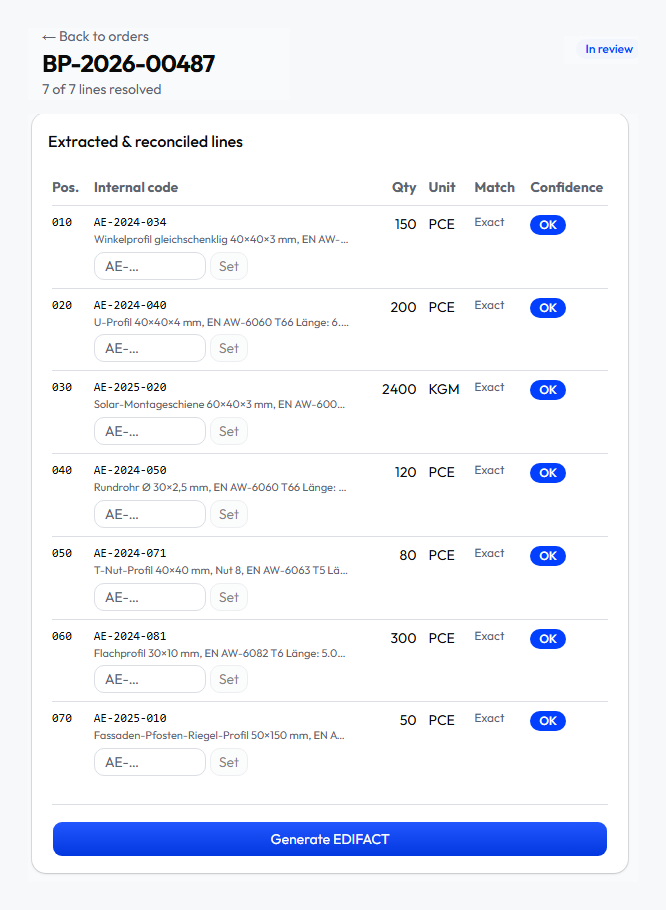
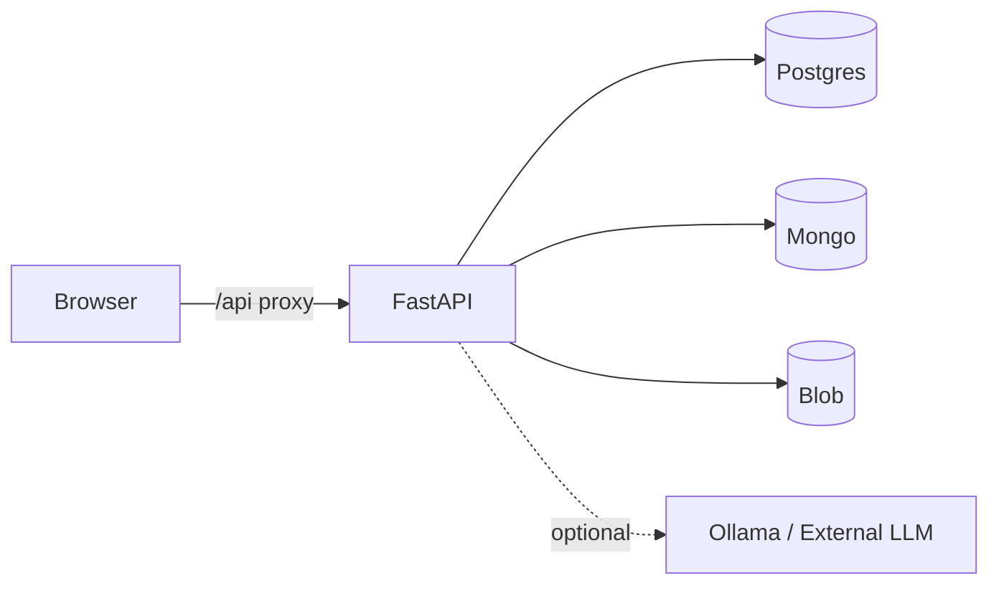

# Order Intake — AluProfil · SACOMP 2026 Challenge

<sub>🌐 **English** · [Português](./README.pt.md)</sub>

> Turn messy customer **PDF purchase orders** into validated **EDIFACT ORDERS
> D.96A** for a legacy ERP — with an operator-in-the-loop reconciliation screen.

A full-stack solution (**FastAPI + Next.js + Postgres/Mongo/Blob**, all in Docker
Compose) to the order-intake challenge from the **Machines Like Me** mini-course
at **SACOMP&nbsp;2026**.

<p>


</p>

<p align="center">
  
  <br>
  <sub>The reconciliation screen: a German order fully resolved to internal <code>AE-</code> codes, every line green, EDIFACT unlocked.</sub>
</p>

---

## The challenge

This repository is a **fork of the workshop starter** used in a **mini-course run
by people from Machines Like Me** (a document-intake automation company) at
**SACOMP 2026**. The starter is a near-blank
full-stack scaffold; the exercise is to build the feature end to end.

**The scenario:** *AluProfil*, an aluminium-extrusion manufacturer, gets ~300
purchase orders a month as **PDFs** from ~100 customers, in four wildly different
formats (German table, Swiss prose, French paragraphs, Swedish dimensions-only).
Four clerks re-type them into a 2009-era ERP (**MetallSoft 7.3**) with a **~30 %
error rate**. The ERP is brutal: **one wrong internal code rejects the entire
order**, and it only speaks **UNOA/ASCII EDIFACT**.

📄 Full problem statement → **[`docs/challenge/`](./docs/challenge/README.md)**

## What I built

A single, swappable **`order_intake` module** that takes a PDF from upload to a
downloadable `.edi`:

- **Three selectable extraction strategies per customer** — a free deterministic
  DIN-table parser, a free local LLM (Ollama), and an external OpenAI-compatible
  LLM (BYO key). Picked with [evidence](./docs/benchmark/README.md), not guesses.
- **Spec-first reconciliation** to the 35-profile catalog — `exact → dimension →
  alloy-alias → fuzzy → learned`. The internal code is **resolved from specs,
  never invented by the LLM**, so a swapped digit can't ship the wrong product.
- **A per-customer learned map** — every operator correction teaches
  `(customer, their code) → internal code`, so repeat orders resolve on their own.
- **Real confidence flags** — concrete deterministic signals (unmatched code,
  ambiguous unit, read-vs-resolved mismatch), never a model probability.
- **Safe EDIFACT** — UNOA/ASCII transliteration + a hard gate that validates
  *every* `PIA+1` before a file can be generated.
- **A reconciliation UI** — original PDF beside the resolved lines, inline
  Set/Confirm, gated "Generate EDIFACT", EN/DE i18n.

## Proof it works

- ✅ **End-to-end verified:** a Bauprofil order produced a valid **55-segment
  `ORDERS:D:96A`** message with correct envelope and transliterated text.
- 📊 **Measured:** [4 customers × 3 strategies benchmarked](./docs/benchmark/README.md)
  for speed and correctness against ground-truth `.edi` files.
- ✅ **82 backend tests** passing; typecheck + lint clean.
- 🔎 **Audited against the brief:** see the honest
  [requirements scorecard](./docs/requirements-audit.md).

## Architecture at a glance



One synchronous `custom/order_intake/` module with cleanly separated, swappable
stages (`ingest → extract → reconcile → confidence → edifact`). Details and
diagrams → **[`docs/architecture/`](./docs/architecture/README.md)**.

## Quick start

```bash
cp .env.example .env       # placeholders are fine for the local stack
./up.sh                    # boots backend, frontend, 3 stores, viewers, ollama
docker compose exec ollama ollama pull qwen2.5:1.5b   # optional: free local LLM
```

Then open **http://localhost:3000/order-intake** (dev-stub login is automatic).
Sample PDFs live in [`docs/sources/orders/`](./docs/sources/orders/). Stop with
`./down.sh`.

> Full run/use guide (strategies, EDIFACT, troubleshooting) →
> **[`ORDER_INTAKE.md`](./ORDER_INTAKE.md)**

| What | URL |
|------|-----|
| App | http://localhost:3000/order-intake |
| API docs (Swagger) | http://localhost:8000/docs |
| DB / Mongo / Blob / Logs viewers | :8081 · :8082 · :8083 · :8084 |

## How it was built

Not "prompt a model to build an app." This was run as a small engineering org
with a **custom multi-agent system**: ideate → put the architecture **on trial**
(adversarial prosecutor/defender/judge) → implement with specialist agents →
audit the delivery. Each hand-off left a written artifact — which is why the
decisions in this repo are recorded, not improvised.

➡️ **[`docs/how-it-was-built.md`](./docs/how-it-was-built.md)**

## Documentation

| | |
|--|--|
| 🎯 [The challenge](./docs/challenge/README.md) | what was asked + the four customers |
| ⚖️ [Decisions (ADRs)](./docs/decisions/README.md) | why it's built this way |
| 🏗️ [Architecture](./docs/architecture/README.md) | how it fits together |
| 📊 [Benchmark](./docs/benchmark/README.md) | strategy comparison with data |
| ✅ [Requirements audit](./docs/requirements-audit.md) | honest scorecard |
| 🤖 [How it was built](./docs/how-it-was-built.md) | the AI-agent workflow |

---

<sub>Built on a workshop starter (FastAPI + Next.js). The authoritative starter
charter is [`WORKSHOP.md`](./WORKSHOP.md); backend/frontend conventions live in
the respective `AGENTS.md` files.</sub>
