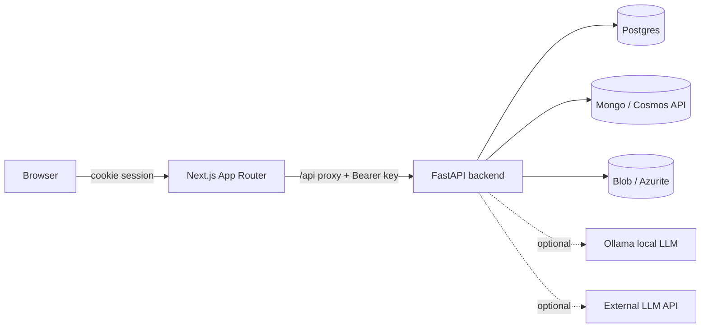
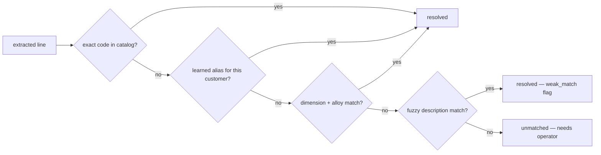

# Architecture

How the `order_intake` feature is put together. For *why* each choice was made,
see the [Architecture Decision Records](../decisions/) and the
[architecture review](../decisions/architecture-review.md) that produced them.

## The stack (provided by the starter)

Everything runs locally via Docker Compose — no cloud account needed.



- **Frontend** — Next.js App Router with a dev-stub login, a server-side `/api`
  proxy, and a generated, fully-typed SDK (`backend.orderIntake.*`).
- **Backend** — FastAPI with auto-discovered modules and a shared-key guard.
- **Three stores, three roles** (all kept per charter §4.3):
  Postgres (relational: orders, lines, catalog, exports), Mongo (raw payload +
  provenance), Blob (the original PDFs + generated `.edi`).

## The feature module (Format C — [ADR-0001](../decisions/0001-single-synchronous-module.md))

```
backend/src/app/modules/custom/order_intake/
├── routes.py            # thin HTTP layer (8 endpoints)
├── schemas/io.py        # request/response contracts
├── logic/
│   ├── flow.py          # synchronous run_intake(): sequences the stages
│   ├── ingest.py        # blob storage + text/markdown extraction (pypdf, pymupdf4llm)
│   ├── extract/         # ← swappable strategies (the "leitor_pdf" pattern)
│   │   ├── bauprofil_text.py   # deterministic DIN-table parser
│   │   ├── llm.py              # LLM spine (ollama + external API)
│   │   └── __init__.py         # dispatch by per-customer strategy
│   ├── reconcile.py     # tiers: exact → dimension → alloy-alias → fuzzy → learned
│   ├── confidence.py    # concrete signals → flags
│   ├── edifact.py       # D.96A generation + UNOA transliteration + PIA+1 gate
│   └── seed.py          # 35-profile catalog seed
├── db/                  # models, queries, Alembic migrations
└── tests.py            # the module's own test suite (82 tests)
```

The `extract/` folder is the swappable-module idea in practice: changing how a
customer's PDF is read means swapping one strategy file, not touching the rest.

## The processing flow

```mermaid
flowchart TD
    A[Upload PDF + customer] --> B[ingest: store blob, extract text/markdown]
    B --> C{customer strategy}
    C -->|bauprofil_text| D1[deterministic DIN parser]
    C -->|ollama / llm_api| D2[LLM extract → structured JSON]
    D1 --> E[reconcile against catalog]
    D2 --> E
    E --> F[confidence: compute concrete flags]
    F --> G[(persist: draft order)]
    G --> H[Reconciliation UI: PDF | resolved lines + flags]
    H --> I{every line resolved?}
    I -->|no| J[operator Set / Confirm — teaches learned map]
    J --> H
    I -->|yes| K[Generate EDIFACT — gated]
    K --> L[validate every PIA+1 + transliterate UNOA]
    L --> M[(download .edi)]
```

This mirrors the analyst's 7-step workflow from the
[discovery brief](../challenge/README.md) one-to-one.

## Request flow & auth

1. The browser hits Next.js; the proxy requires a session cookie (dev-stub login —
   no real identity provider).
2. Client components call `/api/*`; the proxy injects
   `Authorization: Bearer ${BACKEND_API_KEY}` and forwards to FastAPI.
3. FastAPI validates the key and routes to `/custom/order-intake/*`.

After changing any backend endpoint, regenerate the SDK
(`./scripts/update-api-client.sh`); the generated client is never edited by hand.

## Reconciliation tiers



See [ADR-0002](../decisions/0002-resolve-codes-from-specs-not-llm.md) for why the
code is resolved from specs and only cross-checked against what the LLM read.
