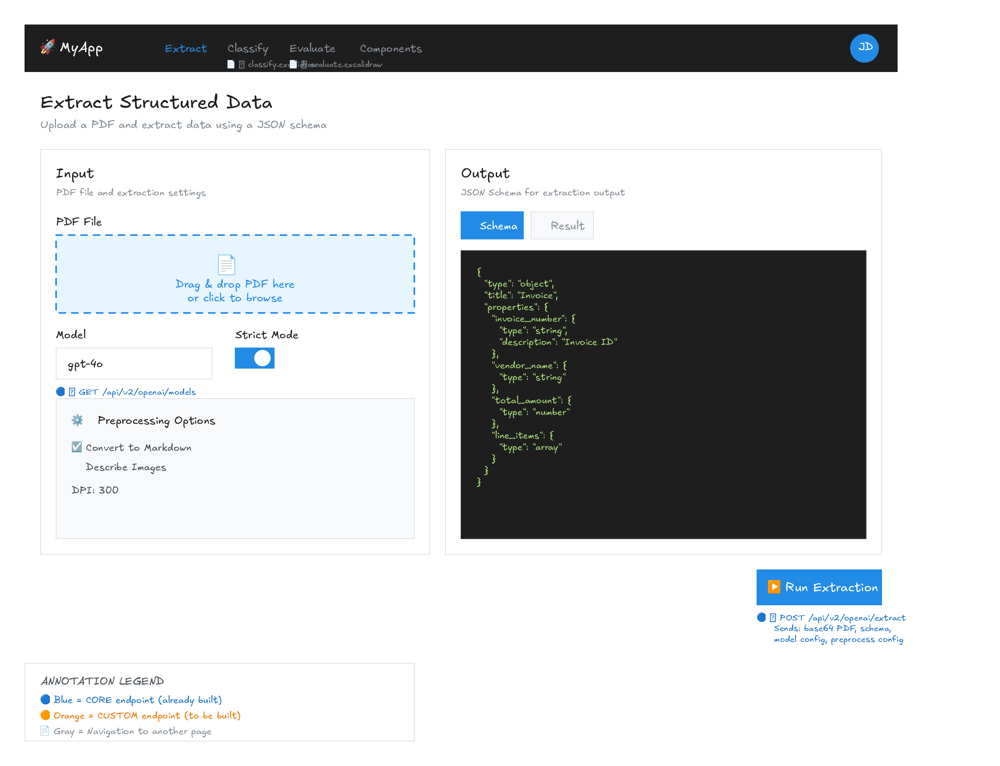

# Feature: Extract (Reference Example)

> ⚠️ **This is a reference example** showing how to document a feature's UI mockup with endpoint annotations. Use this as a template when creating documentation for your own features.

## Overview

The Extract feature allows users to upload a PDF document and extract structured data from it using OpenAI's GPT models. Users define an output schema (JSON Schema format), and the system returns extracted data matching that schema.

## User Interface

The interface consists of two main cards:
1. **Input Card** - PDF upload and extraction settings
2. **Output Card** - Schema editor and extraction results

## User Stories

- As a user, I want to upload a PDF file so that I can extract data from it
- As a user, I want to define a custom output schema so that the extracted data matches my requirements
- As a user, I want to configure preprocessing options so that I can optimize extraction for different document types

## Acceptance Criteria

- [ ] User can upload a PDF file via drag-and-drop or file picker
- [ ] User can select from available OpenAI models
- [ ] User can edit the output schema using a JSON editor
- [ ] User can toggle between schema and result views
- [ ] Extraction results display in a formatted JSON view
- [ ] Error messages are displayed for invalid inputs

## Edge Cases

- **Large PDF files**: Files are processed in chunks using window configuration
- **Invalid JSON schema**: Error message displayed, extraction blocked
- **API timeout**: Loading state with spinner, error message on failure
