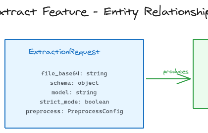

# Domain Entities for Extract Feature

## Entities

### ExtractionRequest

Represents a user's request to extract data from a PDF.

| Attribute | Type | Description | Validation |
|-----------|------|-------------|------------|
| file_base64 | string | Base64-encoded PDF content | Required, valid base64 |
| schema | object | JSON Schema defining expected output | Required, valid JSON Schema |
| model | string | OpenAI model identifier | Required, must be available model |
| strict_mode | boolean | Enforce strict schema validation | Optional, default: false |
| preprocess | PreprocessConfig | Preprocessing options | Optional |

### PreprocessConfig

Configuration for PDF preprocessing before extraction.

| Attribute | Type | Description | Validation |
|-----------|------|-------------|------------|
| convert_to_markdown | boolean | Convert PDF to markdown before extraction | Optional, default: true |
| describe_images | boolean | Generate descriptions for images in PDF | Optional, default: false |

### ExtractionResult

The result of a successful extraction.

| Attribute | Type | Description | Validation |
|-----------|------|-------------|------------|
| result | object | Extracted data matching the schema | Conforms to input schema |
| usage | UsageInfo | Token usage information | Always present |

### UsageInfo

Token usage information for the extraction.

| Attribute | Type | Description | Validation |
|-----------|------|-------------|------------|
| prompt_tokens | integer | Tokens used in the prompt | >= 0 |
| completion_tokens | integer | Tokens used in completion | >= 0 |

### ModelInfo

Information about an available OpenAI model.

| Attribute | Type | Description | Validation |
|-----------|------|-------------|------------|
| id | string | Model identifier (e.g., "gpt-4o") | Required |
| name | string | Display name for the model | Required |

## Relationships

```
ExtractionRequest
    ├── contains → PreprocessConfig (optional)
    └── produces → ExtractionResult
                       └── contains → UsageInfo
```

## Entity Diagram


